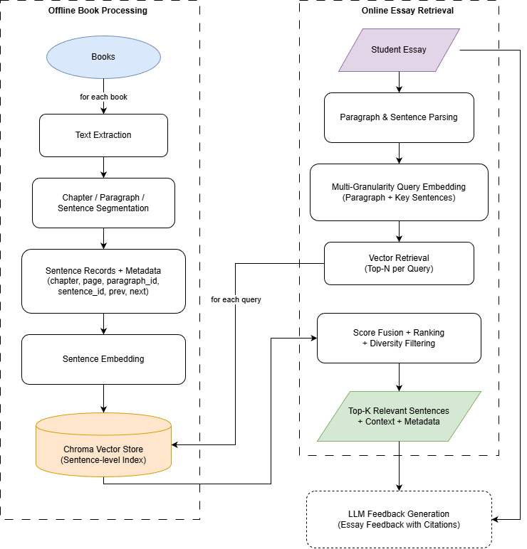

# RAG System Technical Design Document

## Overview

This document describes the design for a **sentence-level Retrieval-Augmented Generation (RAG) system** that provides feedback for student essays. The system indexes book content at the sentence level, constructs multi-granularity queries from student essays (paragraph-level + key-sentence-level), retrieves relevant evidence using local embedding models and ChromaDB, and returns semantically aligned sentences with metadata for downstream feedback generation.

The system consists of two major workflows:
- **Offline Book Processing Pipeline:** PDF ingestion → structural parsing → sentence embedding → vector store indexing.
- **Online Essay Retrieval Pipeline:** Essay analysis → multi-granularity query generation → retrieval → score fusion → ranking.

The high-level architecture is shown below:

## Assumptions & Scope

The following assumptions are made to scope the design.

### Book Format & Structure

- Books are provided as **text-based PDFs** (no OCR required).  
- Each book contains recognizable **chapters**, **paragraphs**, and **sentences**.  

### Scale (Number of Books, Students, Concurrent Users)

- The user can upload up to **20 books** for indexing. Each book contains **50,000–150,000 words**.  
- For each school, total students supported is **up to 1000** but will be easily scalable. 
- For each school, concurrent active users is **up to 1000**. The jobs will be prioritized for real-time processing (students and teachers). Batch processing (teachers) will be done over night.

### Latency Requirements

- End-to-end real-time processing target: **≤ 5 seconds** per essay submission.  
- Batch processing: **≤ 12 hours**.

### Available Compute Resources

- **Proof-of-Concept (PoC):** Sentence-level embedding and vector-similarity retrieval are executed on-premises; LLM-based feedback generation is delegated to a managed cloud service to ensure elasticity and cost-effectiveness.  
- **Production Deployment:** The entire stack—embedding, retrieval, and LLM inference—is containerized and deployed on GPU-accelerated cloud instances (Google Cloud Platform, Azure, or AWS) behind auto-scaling groups for high availability and sub-second latency.

## Clarifications

### Retrieval Granularity: Why Sentence-Level?

Besides the benefits such as avoiding noise introduced by larger units, the strongest reason for using sentence-level retrieval for this application is from the standpoint of the user (student or teacher). By sentence-level retrieval, **the system can provide precise semantic alignment with book content so that the user has clear and direct evidence for the feedback**. 

- Firstly, the user’s first impression of the feedback is very important. It is common for people to adopt a resistant attitude when someone points out “you need to change this or that” in their writing. However, users are far more likely to accept the advice if the feedback is accompanied by direct, reliable evidence drawn from the books.
- Secondly, we cannot expect them to look for evidence from paragraph to paragraph. Instead, the system presents the feedback with citations to the most aligned sentence, shown with its previous and next sentences and an option for "further reading" which points to the whole paragraph in case the user is interested.

#### Chunking approach and metadata strategy

- chunk size: 1 sentence  
- metadata: chapter, page, paragraph_id, sentence_id, prev_sentence_id (null if first sentence of a paragraph), next_sentence_id (null if last sentence of a paragraph)

A sentence-first representation with lightweight contextual metadata allows precise sentence-level retrieval while still being able to present a small local context window to the user.

### Embedding & Retrieval Logic

**Embedding Strategy:**
I’m using **sentence-only embeddings**. This keeps the vector space clean and focused on specific assertions rather than general topics.

#### Query formulation

Multi-Granularity Query Embedding approach (Paragraph + Key Sentences).

- Paragraph-level embedding:
  - Embed the full paragraph text.
  - Used for initial retrieval to cover broad topics.
- Key sentence embeddings (key sentences are extracted by a local small language model):
  - Embed each selected key sentence.
  - Used for fine-grained precision.

#### Retrieval method

- For each paragraph, 1 sentence is retrieved.
- For each key sentence, 1 sentence is retrieved.
- All retrieved sentences are collected; then score fusion, ranking, and diversity filtering are applied to keep the most relevant ones while ensuring diversity.

**Pure semantic search is adopted, without keyword matching.**

I prefer not to use a hybrid retrieval method. 

- Firstly, in this application, the retrieval granularity is sentence-level. Thus, a pure semantic search method will be capable to catch the meaning of the keywords. It's like an advanced "keyword match" in this scenario. 
- Besides, for essays, we care more about students’ ideas than exact wording, and it is common practice to avoid repeating the same words. A sentence can be retrieved even if it shares no words with the query. For example, the essay sentence "Studies show that heavy social media users often experience increased anxiety and decreased attention spans" semantically matches the book sentence "An endless bombardment of news and gossip and images has rendered us manic information addicts," even though they share no common words.

**The number of retrieved sentences (top_k) will match the number of paragraphs in the essay.**

- Usually one idea is expressed in one paragraph, so one sentence with surrounding context is enough to match that.
- Fewer sentences will make it easier for the LLM to generate clear feedback with direct evidence, avoiding overwhelming the user.
- Less context reduces the cost and latency.

### Quality & Relevance Filtering

#### Relevance scoring: How will you ensure retrieved sentences are truly relevant? 

Paragraph-embedding query and key-sentence-embedding query are used for retrieval, which is sufficient to cover most of the ideas in the essay.

To validate the relevance of the retrieved sentences, I will construct a synthetic dataset to test and adjust my retrieval logic.

1. Randomly select 100 sentences from the book.
2. For each sentence, I will use an LLM to generate its variants at three levels:
    - Level 1 variant: minor rewrites
    - Level 2 variant: full paraphrases
    - Level 3 variant: heavily reworded queries that preserve the original claim
3. For each variant, I will run the retrieval pipeline and compute standard IR metrics such as Recall@K and Mean Reciprocal Rank (MRR).
4. Adjust the retrieval logic, or even the embedding model, based on the performance of the synthetic dataset.

#### Diversity: How will you avoid retrieving very similar sentences? 

Set a threshold (e.g., cosine similarity > 0.9) to filter out similar sentences.

#### Context preservation: How will you ensure sentences make sense when presented to the LLM? 

Sentences in the final collection will be presented to the LLM with their previous and next sentences as context.

### Integration with LLM Feedback Generation

#### Prompt design: How will retrieved sentences be formatted in the LLM prompt? 

The retrieved sentences will be formatted using a structured, numbered evidence block. Each sentence is shown with its book/chapter/page metadata and previous and next sentences.

Example formatting:

>Retrieved Evidence:
>1. "sentence text"
    (Book X, Chapter Y, Page Z)
    Previous: <prev_sentence>
    Next: <next_sentence>
>2. "sentence text"
    (Book X, Chapter Y, Page Z)
    Previous: <prev_sentence>
    Next: <next_sentence>

#### Citation strategy: How will students see which book sentences were used? 

To ensure transparency and trust, all retrieved textbook sentences used in the feedback are explicitly shown to the student in an **Evidence Section**, following the feedback.

Each retrieved sentence is:

1. Numbered uniquely (e.g., Evidence #1, Evidence #2).
2. Displayed with its Book, chapter, page number.
3. Accompanied by its previous and next sentence for context.
4. Linked directly to the LLM feedback, which cites evidence by number.

Example student-facing display:

> ...Your claim about reduced attention span is supported by the book Digital Minimalism, which states that “an endless bombardment of news and images has rendered us manic information addicts (**Evidence #1**)...
> 
> Evidence Used:
> 1. *Its subtitle was alarming: **“An endless bombardment of news and gossip and images has rendered us manic information addicts. It broke me. It might break you, too.”***
    (Digital Minimalism, Chapter 2, Page 35)

#### Feedback types: What kinds of feedback can be enhanced by sentence-level retrieval? 

I used to work on a project that aimed to score K-12 students’ Chinese and English writing. We found that the scoring would be more objective and reliable if we built clear scoring dimensions that don't overlap. I think this experience might help in this application, too. 

With this in mind, I would break the feedback in three aspects:

- **Content (can be enhanced by RAG)**. The core value and logic of writing—what is written, including relevance to the topic, depth of ideas, sufficiency of supporting details (e.g., data, arguments)
- **Expressions (can be done by the LLM itself).** The delivery and accuracy of writing—how it is written, including grammatical correctness, appropriate vocabulary use, sentence variety, fluency, and natural expression.
- **Features (can be done by the LLM itself).** Whether the writing aligns with the genre-specific characteristics—including format compliance, tone appropriateness, and stylistic consistency.

Among these three dimensions, the first dimension, content, benefits most from RAG. I will focus on the content dimension by explicitly requiring in the prompt using statement like **"Use the retrieved sentences to provide comments and advice on the content of the student's writing, including relevance to the topic, depth of ideas, and sufficiency of supporting details (e.g., data, arguments)."**

